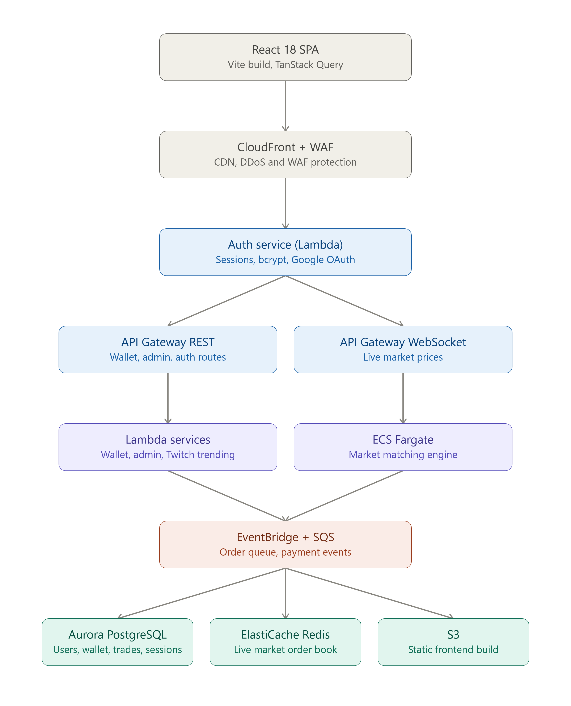
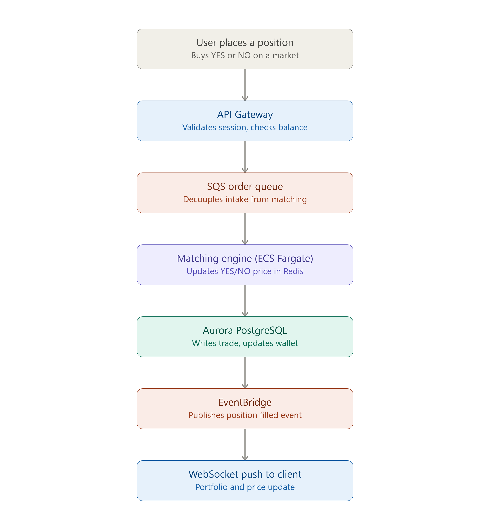

# Peaky Blinders Prediction Market

A white-label prediction-market experience ("FanEngine", badged IPX) demoed under a
Peaky Blinders skin. See [`ENGINEERING_REPORT.md`](./ENGINEERING_REPORT.md) for the
full story of how this repo got here, and [`PROJECT_STATUS.md`](./PROJECT_STATUS.md)
for what's actually real vs. still a demo right now.

## Layout

```
app/                    The real thing — Vite + React + TypeScript source.
                         This is what you build on. See app/README.md to run it
                         and for exactly how to wire up a real backend.

index.html               \
assets/                   |  The original compiled build as delivered — kept
login.html, signup.html  /  for reference. Static, no backend, demo data only.

docs/images/             Architecture diagrams — see "Target architecture" below.
```

## Quick start

```bash
cd app
npm install
npm run dev:full    # http://localhost:3000 — frontend + API together (needs app/.env.local)
```

`npm run dev` alone only serves the frontend on :5173 — auth, wallet and every other
`/api/*` route need `dev:full` (see `app/README.md` for what goes in `.env.local`).

## Target architecture

The diagrams below describe where this is headed on AWS: API Gateway, Lambda
services, an ECS Fargate matching engine, Aurora Postgres, ElastiCache Redis for
live order-book pricing, and EventBridge/SQS wiring trades through to a WebSocket
price feed.

### System overview



### Trade flow (place a position → price update)


